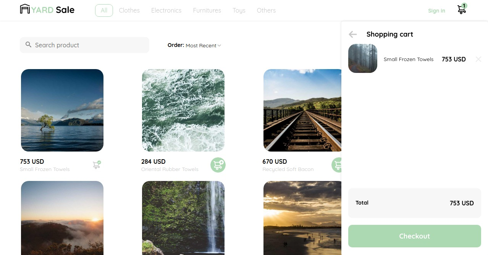

# Platzi - Yard Sale solution

This is a solution to the [Yard-sale store challenge on Platzi](https://www.figma.com/file/bcEVujIzJj5PNIWwF9pP2w/Platzi_YardSale?node-id=0-719). Yard sale is a  challenges that help me improve coding skills by building realistic projects.

## Table of contents

- [Overview](#overview)
  - [The challenge](#the-challenge)
  - [Screenshot](#screenshot)
  - [Links](#links)
- [My process](#my-process)
  - [Built with](#built-with)
  - [What I learned](#what-i-learned)
  - [Continued development](#continued-development)
  - [Useful resources](#useful-resources)
- [Author](#author)
- [Acknowledgments](#acknowledgments)

## Overview

### The challenge

Users should be able to:

- View the optimal layout the store and depending on their device's screen size
- Register, login, sign out, edit account and password recovery
- View list products and view select product
- View shopping cart and maintain state on  product selected
- View actually order and all orders
- add to shopping cart, delete from cart any product
- **Bonus**: session recovery and maintain the state after refreshing the browser
- **Bonus**: view the optimal layout the page login and password recovery only at 
mobile screen 
- **Bonus**: SEO strategies

### Screenshot



### Links

- Solution URL: [https://github.com/Cdrn19/yard-sale](https://github.com/Cdrn19/yard-sale)
- Live Site URL: [https://cdrn19-yardsale.netlify.app/](https://cdrn19-yardsale.netlify.app/)

## My process

### Built with

- Semantic HTML5 markup
- CSS custom properties
- Flexbox
- CSS Grid
- BEM Methodology
- Pixel Perfect
- Atomic Desing 
- ECMAScript 6
- GitFlow
- [Webpack](https://webpack.js.org/) - Module bundler
- [SASS](https://sass-lang.com/) - CSS preprocessor
- [Axios](https://axios-http.com/) - JS framework
- [React JS](https://reactjs.org/) - JS framework
- [React Router](https://reactrouter.com/) - JS framework
- [Vanilla JS](http://vanilla-js.com/) - JS framework

### What I learned

In this opportunity i learned the tools on React such as `useRef()` to take input data and maintain it. 

Using data controled by React and its tools to facilitate the development for example in this case: 

```html
  <form action="/" className="login__form" ref={form}>
  </form>
```

I reference the form `ref={form}` and keep all inputs regardless if they are correct.

To this case i validate data with:

```js
  const handleSubmit = async (event) => {
    event.preventDefault();
    const formData = new FormData(form.current);
    const data = {
      email: formData.get("email"),
      password: formData.get("password"),
    };
    if (data.email && data.password) {
      !auth.isLoading && auth.signIn(data);
      setToggle([false, false]);
    } else if (!data.email || !data.password) {
      if (!data.password & !data.email) {
        setToggle([true, true]);
      } else if (!data.email) {
        setToggle([true, false]);
      } else if (!data.password) {
        setToggle([false, true]);
      }
    }
  };
```
And thus avoid resetting the input data and asking the user for a correction and a new request.

In development, implement the `useAuthRoute.js` hook to limit access to certain routes if the user is not logged in.

```js
import { Navigate, useLocation } from "react-router-dom";
import { useAuth } from "@hooks/useAuth";

export function AuthRoute({ children }) {
  const auth = useAuth();
  const location = useLocation();

  return !auth.user ? (
    <Navigate to="/signin" state={{ from: location }} replace />
  ) : (
    children
  );
}

```

This project was developed based on each design and respecting the functions of each component represented in each of the layouts.

### Continued development

In the project directory, you can run:

```console
npm install
```

installation of dependencies. 

```console
npm run start
```

Run the app in development mode. 

Open in browser [http://localhost:3000](http://localhost:3000) or [http://127.0.0.1:3000](http://127.0.0.1:3000). You can also enter assigned IP of your local network to be able to see the project on other devices.

```console
npm run dev
```

Build project using **development settings**. 

```console
npm run build
```

Build project using **production configuration**.

```console
npm run lint
```

Find problems in your JavaScript code.

```console
npm run lint:fix
```

Find and fix problems in your JavaScript code and formatting

### Useful resources

- [Babel](https://babeljs.io/) - JavaScript compiler.
- [ESlint](https://eslint.org/) - Find and fix problems in JavaScript code.
- [Prettier](https://prettier.io/) - code formatter.

## Author

- Website - [Carlos Revetti](https://cdrn19.github.io)
- Platzi - [@Cdrn19](https://platzi.com/p/cdrn19/)

## Acknowledgments

I want to give thanks to [Platzi](https://platzi.com/) website for making these projects and its community.